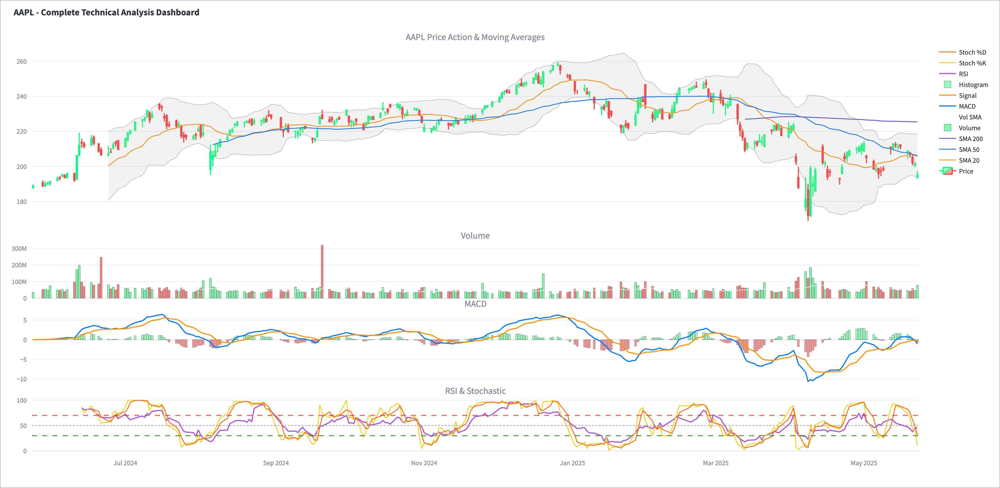
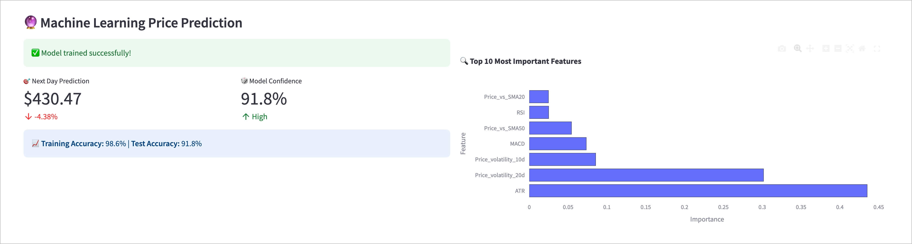
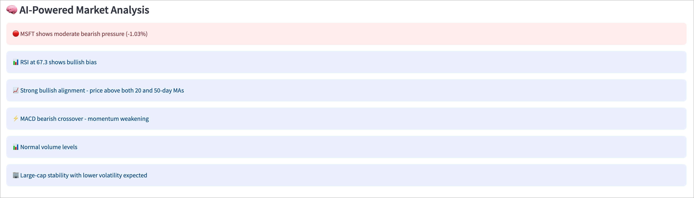

# 🚀 AI-Powered Stock Market Dashboard

[](https://www.python.org/)
[](https://streamlit.io/)
[](LICENSE)
[](https://github.com/erikthiart/ai-stock-dashboard)

> **Professional-grade stock analysis with machine learning predictions and real-time technical indicators**

A comprehensive, AI-powered stock market dashboard that combines advanced technical analysis, machine learning price predictions, and intelligent market insights in a beautiful, interactive interface.


## ✨ Features

### 🤖 **Artificial Intelligence**
- **Machine Learning Price Prediction** - Random Forest model with 30+ technical features
- **AI Market Analysis** - Natural language insights based on technical indicators
- **Feature Importance Analysis** - Understand what drives price movements
- **Model Performance Metrics** - Train/test accuracy with confidence levels

### 📈 **Advanced Technical Analysis**
- **Professional Charts** - Multi-panel candlestick charts with technical overlays
- **20+ Technical Indicators** - RSI, MACD, Bollinger Bands, Moving Averages, Stochastic
- **Volume Analysis** - Volume trends and confirmation signals
- **Performance Metrics** - Sharpe ratio, volatility, maximum drawdown

### 🎯 **Real-Time Data**
- **Live Stock Data** - Real-time prices from Yahoo Finance
- **Multiple Timeframes** - 1M to 5Y analysis periods
- **Popular Stock Presets** - Quick access to FAANG+ stocks
- **Custom Symbol Input** - Analyze any publicly traded stock

### 🎨 **Professional Interface**
- **Dark Theme** - Easy on the eyes for extended analysis
- **Responsive Design** - Works perfectly on desktop and mobile
- **Interactive Charts** - Zoom, pan, and explore data
- **Organized Tabs** - Clean separation of different analysis types



## 🚀 Quick Start

### Prerequisites

```bash
Python 3.8 or higher
```

### Installation

1. **Clone the repository**
```bash
git clone https://github.com/erikthiart/ai-stock-dashboard.git
cd ai-stock-dashboard
```

2. **Install dependencies**
```bash
pip install -r requirements.txt
```

3. **Run the application**
```bash
streamlit run stock_dashboard.py
```

4. **Open your browser**
```
Navigate to http://localhost:8501
```



## 📦 Dependencies

```
streamlit>=1.28.0
yfinance>=0.2.18
pandas>=1.5.0
numpy>=1.24.0
plotly>=5.15.0
scikit-learn>=1.3.0
```

## 🎮 How to Use

### 1. **Select Your Stock**
- Choose from popular presets (Apple, Tesla, Google, etc.)
- Or enter any stock symbol manually
- Select your preferred analysis timeframe

### 2. **Explore the Analysis**
- **Main Dashboard**: Key metrics and price changes
- **Technical Charts**: Advanced multi-panel analysis
- **Performance**: Risk metrics and cumulative returns
- **AI Predictions**: Machine learning price forecasts
- **Market Analysis**: AI-generated insights

### 3. **Understand the Insights**
- 🟢 **Green indicators**: Bullish signals
- 🔴 **Red indicators**: Bearish signals  
- 🟡 **Yellow indicators**: Neutral/mixed signals
- ⚠️ **Warning indicators**: Overbought/oversold conditions


## 🧠 Machine Learning Model

Our AI uses a **Random Forest Regressor** trained on 30+ features including:

- **Price-based features**: Returns, volatility, price changes
- **Technical indicators**: RSI, MACD, moving averages
- **Volume features**: Volume ratios and trends  
- **Lag features**: Historical price and volume data
- **Statistical features**: Rolling means and standard deviations

**Model Performance:**
- Real-time training on historical data
- Cross-validation with train/test splits
- Feature importance analysis
- Confidence metrics displayed



## 📊 Technical Indicators

| Indicator | Purpose | Interpretation |
|-----------|---------|----------------|
| **RSI** | Momentum | >70 Overbought, <30 Oversold |
| **MACD** | Trend | Signal line crossovers |
| **Bollinger Bands** | Volatility | Price vs. bands position |
| **Moving Averages** | Trend | Price vs. MA relationships |
| **Stochastic** | Momentum | %K and %D oscillator |
| **Volume** | Confirmation | Volume vs. average ratios |

## 🎯 Use Cases

### 📈 **For Traders**
- Quick technical analysis of any stock
- AI-powered price predictions for next trading day
- Volume confirmation signals
- Multiple timeframe analysis

### 💼 **For Investors**
- Long-term performance metrics
- Risk assessment (volatility, drawdown)
- Company fundamental information
- Market trend analysis

### 🎓 **For Learning**
- Understanding technical indicators
- Machine learning in finance
- Market behavior patterns
- Professional chart analysis


## ⚠️ Disclaimer

**This tool is for educational and informational purposes only.**

- Not financial advice or investment recommendations
- Past performance doesn't guarantee future results
- Always do your own research before investing
- Consider consulting with financial professionals
- Markets involve risk and potential loss of capital

## 🛠️ Technical Architecture

```
├── stock_dashboard.py      # Main application
├── requirements.txt        # Dependencies
├── README.md              # Documentation
└── screenshots/           # UI screenshots
    ├── main_dashboard.jpg
    ├── technical_analysis.jpg
    ├── ml_predictions.jpg
    ├── performance_metrics.jpg
    ├── ai_analysis.jpg
    └── company_info.jpg
```

## 🤝 Contributing

Contributions are welcome! Please feel free to submit a Pull Request.

1. Fork the repository
2. Create your feature branch (`git checkout -b feature/AmazingFeature`)
3. Commit your changes (`git commit -m 'Add some AmazingFeature'`)
4. Push to the branch (`git push origin feature/AmazingFeature`)
5. Open a Pull Request

## 📝 License

This project is licensed under the MIT License - see the [LICENSE](LICENSE) file for details.

## 🌟 Acknowledgments

- **Yahoo Finance** for providing free stock data
- **Streamlit** for the amazing web framework
- **Plotly** for interactive visualizations
- **scikit-learn** for machine learning capabilities

## 📞 Support

If you find this project helpful, please give it a ⭐ on GitHub!

For questions or issues:
- Open an [Issue](https://github.com/erikthiart/ai-stock-dashboard/issues)

---

<div align="center">

**Built with ❤️ and Python**

[](https://github.com/erikthiart)
[](https://linkedin.com/in/erikthiart)

</div>

---

## 🛰️ Observable Quote Cache Service (`/status`)

Alongside the Streamlit app, a FastAPI service converges configuration parsing,
the on-disk quote cache and prefetch scheduling into one observable surface.

### Run

```bash
uvicorn service.main:app --port 8000
# open http://127.0.0.1:8000/status
```

### Configuration precedence

Resolution order is **environment variable (`STOCK_*`) > `config.toml` > built-in default**.
Missing keys fall back to defaults, are highlighted yellow on `/status` and emit a
startup warning log. Invalid values fail startup immediately, naming the key and the
expected type, e.g.:

```
configuration error: invalid configuration for cache.ttl_seconds: expected positive number (seconds), got 'banana'
```

| Key | Env var | Type |
|-----|---------|------|
| `upstream.provider` | `STOCK_UPSTREAM_PROVIDER` | `yfinance` or `fake` |
| `upstream.request_timeout` | `STOCK_UPSTREAM_REQUEST_TIMEOUT` | positive seconds |
| `cache.ttl_seconds` | `STOCK_CACHE_TTL_SECONDS` | positive seconds |
| `cache.dir` | `STOCK_CACHE_DIR` | directory path |
| `watchlist` | `STOCK_WATCHLIST` | comma-separated symbols |
| `prefetch.lock_timeout` | `STOCK_PREFETCH_LOCK_TIMEOUT` | non-negative seconds |

### Guarantees

- **TTL hit**: reads inside TTL return the cached entry and bump the hit counter.
- **Explicit refresh still penetrates**: `GET /api/quotes/{symbol}?refresh=true`
  and the page's **强制刷新** button bypass TTL and always hit upstream.
- **Singleflight**: concurrent fetches for the same key share one upstream pull;
  merged waits are counted as `lock_waits` / `singleflight_merged`.
- **Atomic persistence**: entries are written via temp file + `os.replace` and
  carry a `schema` version; mismatched schema is treated as expired and replaced.
- **Failure never clobbers cache**: a failed upstream pull on an existing entry
  serves the stale quote (`source: "stale"`) instead of overwriting it.
- **Incremental prefetch**: `POST /prefetch` shares the same cache and locks as
  queries; fresh entries are skipped (`skipped`), only missing/expired keys pull.

### API

- `GET /api/quotes/{symbol}[?refresh=true]` — read-through query
- `POST /prefetch` — body `{"symbols": ["AAPL"]}` or `{}` for the watchlist
- `POST /refresh` — same body, forces upstream pull for every symbol
- `GET /api/status` — JSON backing the page (config sources + cache counters)
- `GET /status` — table page with **触发预取** / **强制刷新** buttons

For network-free/deterministic runs set `STOCK_UPSTREAM_PROVIDER=fake`
(the `FLAKY` symbol always fails upstream to exercise stale-cache behavior).

### Acceptance tests

```bash
npx playwright test tests/status.spec.ts
```

Covers prefetch-then-hit, force-refresh penetration, stale cache preserved on
upstream failure, config source badges, and invalid config failing at startup.
